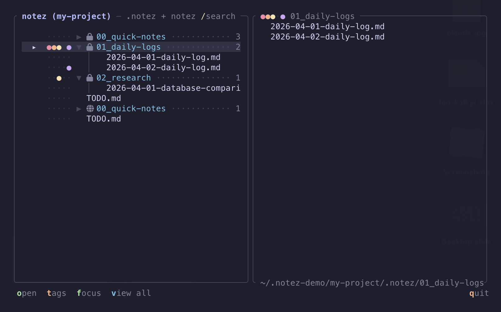
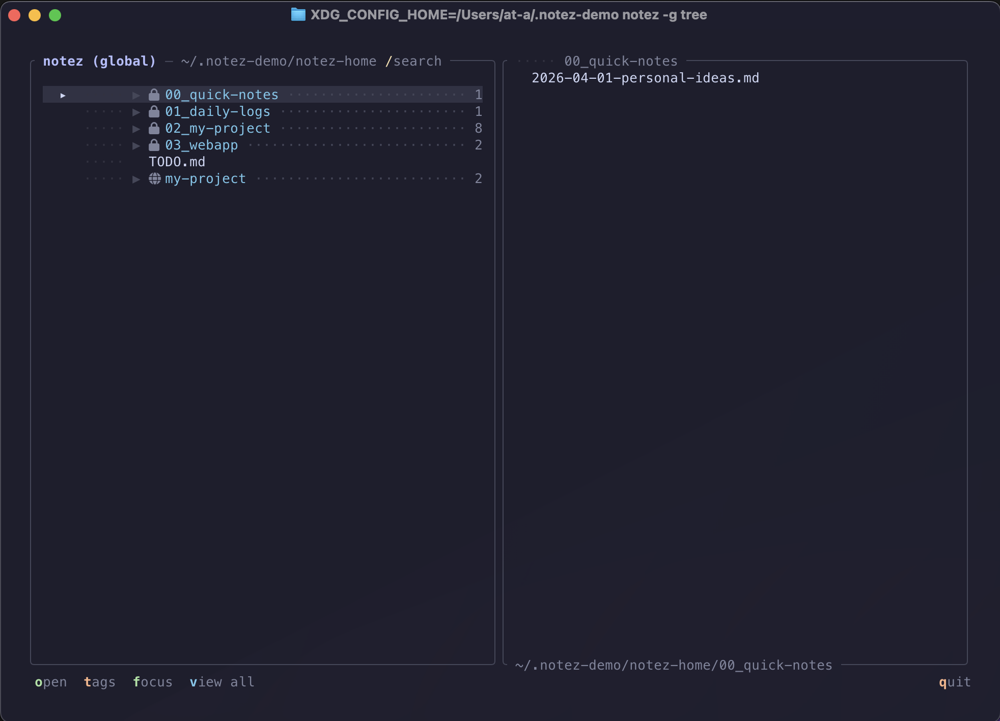
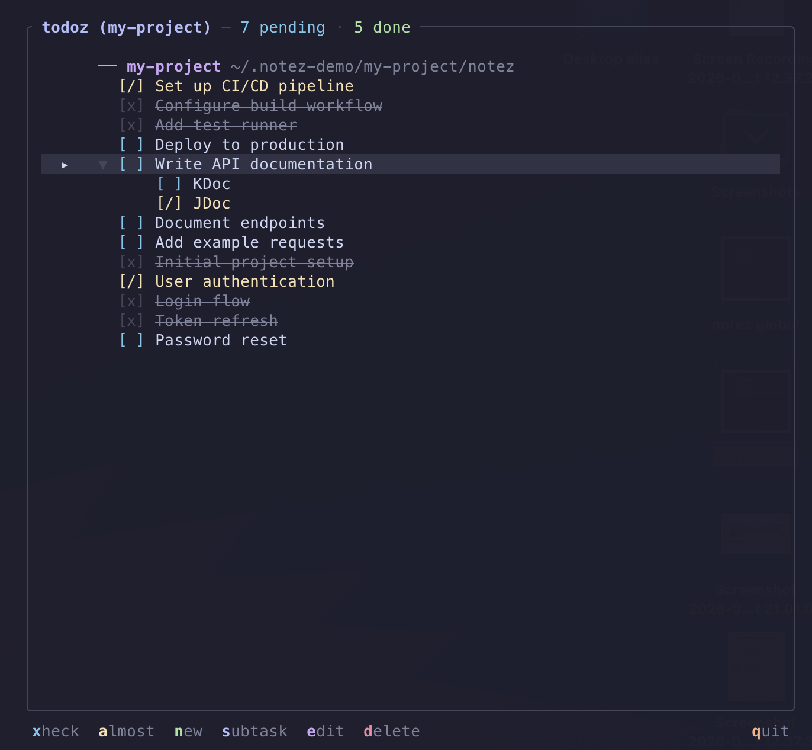
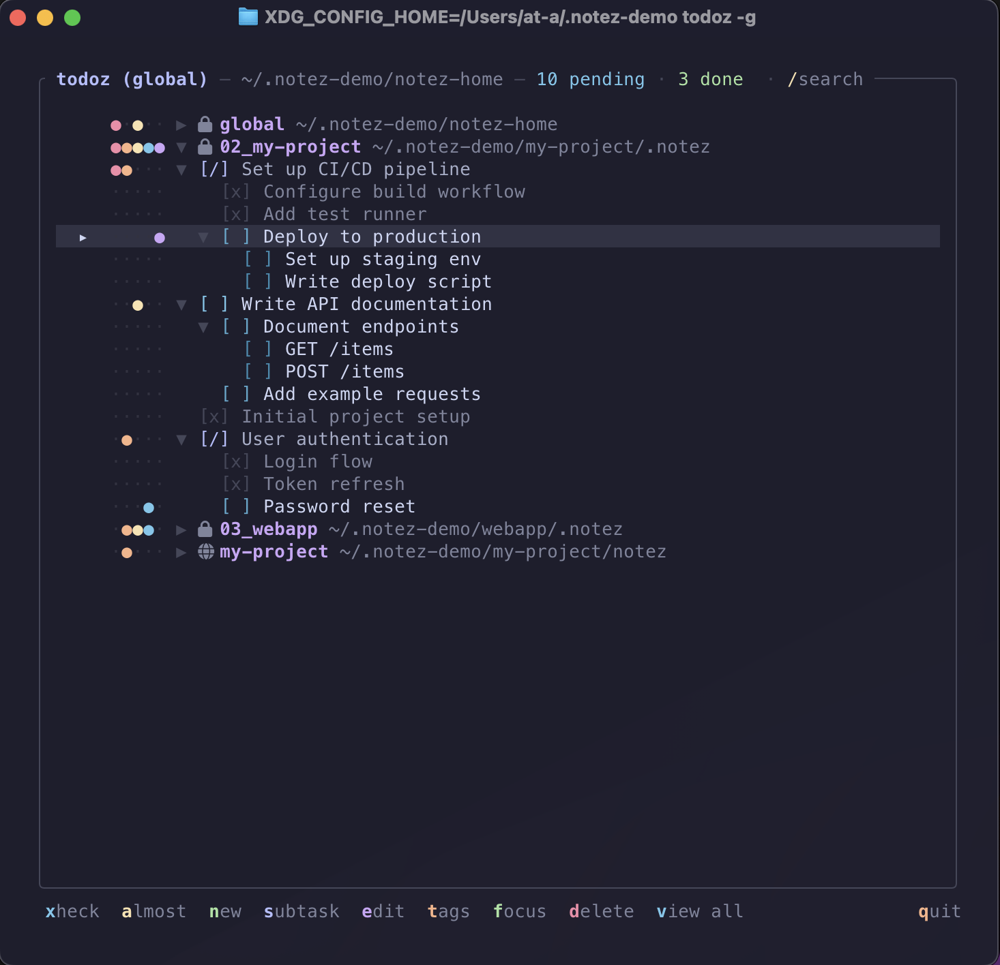

# notez


A local-first CLI note-taking tool. Notes live with your projects, mirrored to a home directory for a unified view. Comes with [**todoz**](#todoz), a full interactive todo manager.



## Install

```bash
git clone https://github.com/Gaurgle/notez-cli.git
cd notez-cli
./install.sh
```

Requires the Rust toolchain (`cargo`). Optional tools detected during setup: `yazi`, `fzf`, `rg` (built-in fallbacks if missing).

## Setup

```bash
notez setup
```

A friendly step-by-step wizard that configures your home notes folder, directory names, and detects available tools.

## How It Works

**Private by default:** All commands write to `.notez/` (hidden, auto-gitignored). Your notes stay private and never get committed to the project repo.

**Public with `-p`:** Add `-p` to any command to write to `notez/` instead. These notes travel with the project and can be committed.

**Home mirror:** Private notes are symlinked into `~/notez/` under a project directory (auto-created, named after your git repo). Push `~/notez/` as a private repo to sync notes across machines.

**Global mode (`-g`):** Target `~/notez/` directly for notes that aren't tied to a project.

```
~/Repos/my-project/
  .notez/                           ← private (default, gitignored)
    00_quick-notes/
    01_daily-logs/
    TODO.md
  notez/                            ← public (-p flag, committed)
    00_quick-notes/
    TODO.md

~/notez/                            ← unified home view
  00_quick-notes/                   ← global quick notes (-g)
  01_daily-logs/                    ← global daily logs (-g)
  02_my-project/                    ← symlinks from .notez/ (private)
  TODO.md                           ← global todos (-g)
```

### Scope Flags

| Flag | Scope | Directory |
|---|---|---|
| _(default)_ | Private | `.notez/` (gitignored) |
| `-p` | Public | `notez/` (committed with project) |
| `-g` | Global | `~/notez/` (all projects) |

```bash
notez add my idea                   # → .notez/  (private)
notez add -p shared docs           # → notez/   (public)
notez -g add personal thought      # → ~/notez/ (global)
```

## Commands

All commands default to private `.notez/`. Add `-p` for public `notez/`, or `-g` for global `~/notez/`.

### Notes

| Command | Description |
|---|---|
| `notez add [title]` | Create a private note, open in editor |
| `notez add -p [title]` | Create a public note |
| `notez add [title] "body text"` | Create a note with content (no editor) |
| `notez add [title] --in` | Pick a subdirectory under `~/notez/` (fzf, globe/lock icons) |
| `notez add [title] --in --in-local` | Pick a subdirectory under the local `.notez/` instead |
| `notez edit [term]` | Open an existing note (fuzzy across **all** notes, global + mirrored local) |

Multi-word titles work without quotes: `notez add my cool idea`

### Daily Logs

| Command | Description |
|---|---|
| `notez log <message>` | Append a timestamped entry to today's log |
| `notez logz` / `notez logs` | Browse daily logs |

### Tree Browser

| Command | Description |
|---|---|
| `notez tree` | Interactive tree with preview (private + public) |
| `notez -p tree` | Public notes only |
| `notez -g tree` | All projects (private + public, with scope icons) |
| `notez` | Browse notes in yazi |
| `notez nav` / `notez -n` | Pick a global subdirectory (globe/lock icons), open in yazi |
| `notez search <term>` | Search note content across **all** notes (rg + fzf) |
| `notez mkdir <name>` | Create a numbered subdirectory |

**Tree keybindings:**

| Key | Action |
|---|---|
| `o` / `Enter` | Open file in editor / toggle directory |
| `h` / `l` | Collapse / expand directory |
| `t` | Tags: press `1`-`5` to toggle colored flags |
| `f` | Focus directory (toggle, collapses all others) |
| `/` | Search / filter (shown in title bar) |
| `v` | Toggle view all / collapse all |
| `J` / `K` | Scroll preview pane |
| `j` / `k` / mouse scroll | Navigate (mouse also scrolls preview) |
| `?` | Help overlay |
| `q` / `Esc` / `Ctrl+C` / `:wq` | Quit (`Esc` clears search first) |

**Preview pane:** Shows file content with markdown highlighting, or directory listing. Resolved file path shown at the bottom. Tags shown in the preview title.

**Tags:** Same system as todoz: 5 colored dot flags, persisted in `.tags` files. Directory nodes aggregate tags from their children.



---

## todoz

A full interactive todo manager, installed as a standalone command alongside notez.

| Command | Description |
|---|---|
| `todoz` | Interactive todo manager (private + public) |
| `todoz -p` | Public todos only |
| `todoz "item"` | Quick-add a private todo |
| `todoz -g` | All todos across every project (private + public) |



**Keybindings:**

| Key | Action |
|---|---|
| `x` / `space` / `Enter` | Check/uncheck (on parent: toggles all subtasks) |
| `a` | Almost done `[/]` |
| `n` | New todo |
| `N` | New top-level category (global view only) |
| `s` | Add subtask (two levels deep) |
| `e` | Edit text (←/→ to move cursor) |
| `d` | Delete (y/n confirm) |
| `t` | Tag mode: `1`-`5` toggle, `t` again to close (multi-tag friendly) |
| `f` | Focus section (toggle, collapses all others) |
| `/` | Filter: fuzzy text + `#tagname` (or click strip dots) |
| `J` / `K` | Move todo down / up (block-aware: subtree moves with parent) |
| `h` / `l` | Collapse / expand (subtasks + project sections) |
| `v` | Toggle view all / collapse all |
| `j` / `k` / mouse scroll | Navigate |
| `?` | Help overlay |
| `q` / `Esc` / `Ctrl+C` / `:wq` | Quit (`Esc` clears search first) |

**Mouse:**

| Action | Effect |
|---|---|
| Click section header | Toggle expand / collapse |
| Click body of a parent task | Toggle expand / collapse |
| Click a tag dot on a row | Toggle that tag on the task |
| Hover a tag dot | Faint preview of the tag color |
| Click the filter strip (left of search) | Toggle that tag in the active filter |
| Click the search field | Enter typing mode |
| Click + drag a row | Reorder within the same section / depth |

**Todo states:** `[ ]` unchecked → `[/]` almost done → `[x]` checked

**Subtasks:** Two levels deep. Press `s` on any todo or subtask to nest under it. Parent state auto-derived from child completion.

**Tags:** 5 colored flags (●) shown to the left of each todo: important (red), priority (orange), long-term (yellow), idea (blue), blocked (purple). Toggle by clicking the dot, or press `t` to enter tag mode and use `1`-`5`. Tag mode stays open across navigation so you can tag multiple tasks in one go. Press `t` again (or `Esc`) to close. Tags stack and are persisted as `#important #prio #longterm #idea #blocked` in the markdown. Section headers and parent tasks aggregate tags from their children.

**Categories (`-g`):** Top-level groups under `~/notez/_todos/<name>/TODO.md`. Press `N` in global view to create a new one. They sort alphabetically alongside the rest.

**Focus mode:** Press `f` to focus the current section. All others collapse. Navigate between sections and focus auto-follows. Press `f` again to restore the previous view.

**Filter:** Press `/` (or click the search field) to start filtering. Text matches fuzzily; `#tagname` filters by tag with prefix support. `#imp` matches `#important`, `#i` matches `#important` and `#idea`, `#1`–`#5` reference tags by index, `#13` = tag 1 ∪ tag 3, `#` alone matches anything tagged. Multiple tokens combine with AND across, OR within. Click the dim dots next to the search field to toggle tags directly. `Enter` keeps the filter active, `Esc` clears it. Filter auto-expands matching sections so results are immediately visible.

**Reorder:** `J`/`K` (shift) moves a todo up or down within its section, taking subtasks with it. Mouse: click + drag a row to reorder.

**Code TODOs:** Automatically scans project source for `// TODO`, `# TODO`, `-- TODO`, `/* TODO`, `<!-- TODO` comments. Displayed as a read-only section with file path and line number, visible alongside your todos but non-interactive.

**Global view (`todoz -g`):** Projects start collapsed. Expand with `l`. Aggregates private + public todos from all projects, each with a lock/globe indicator.



---

## Standalone Commands

Installed automatically as symlinks, no aliases needed.

**Naming convention:** `z<verb>` for write/append commands (act on data), `<noun>z` for view/manage TUIs (open something). The brand `notez` is itself the noun-z form.

| Command | Same as | What it does |
|---|---|---|
| `znote [title]` | `notez add` | Create a note (write) |
| `zlog <message>` | `notez log` | Append daily log entry (write) |
| `editz [term]` | `notez edit` | Open existing note (edit) |
| `todoz` | `notez todo` | Todo manager TUI |
| `treez` | `notez tree` | Notes tree browser TUI |
| `logz` | `notez logz` | Daily logs browser TUI |
| `findz <term>` | `notez search` | Search notes content |

All accept the global flags `-g` (target `~/notez/`) and `-p` (target project's public `notez/`).

### Shell integration

`notez init <shell>` prints shell-side helpers (most importantly `noglob` wrappers around write commands so messages with `?` and `*` don't need quoting). Add this single line to your shell rc instead of maintaining aliases by hand:

```bash
# .zshrc
eval "$(notez init zsh)"
```

Currently supports `zsh`. `bash` and `fish` are accepted but emit no helpers (they don't have zsh's glob behavior on command args).

## Setup & Config

| Command | Description |
|---|---|
| `notez setup` | Interactive setup wizard |
| `notez completions <shell>` | Generate shell completions (zsh, bash, fish) |
| `notez -h` | Styled help with keybinding reference |
| `notez demo` | Create demo project for screenshots |

## Tab Completions

```bash
mkdir -p ~/.zfunc
notez completions zsh > ~/.zfunc/_notez
```

Add to `.zshrc`:
```bash
fpath=(~/.zfunc $fpath)
autoload -Uz compinit && compinit
```

## Optional Tools

| Tool | Used for | Fallback |
|---|---|---|
| `yazi` | Browsing notes | Opens in `$EDITOR` |
| `fzf` | Directory picker, search UI | Numbered list selection |
| `rg` | Fast content search | `grep -r` |

## Config

Stored at `~/.config/notez/config`. Project mappings at `~/.config/notez/projects`. Re-run `notez setup` to reconfigure.

## Also

Check out [repoz](https://github.com/Gaurgle/repoz): see which repos need pulling, pushing, or have uncommitted work. One command.
